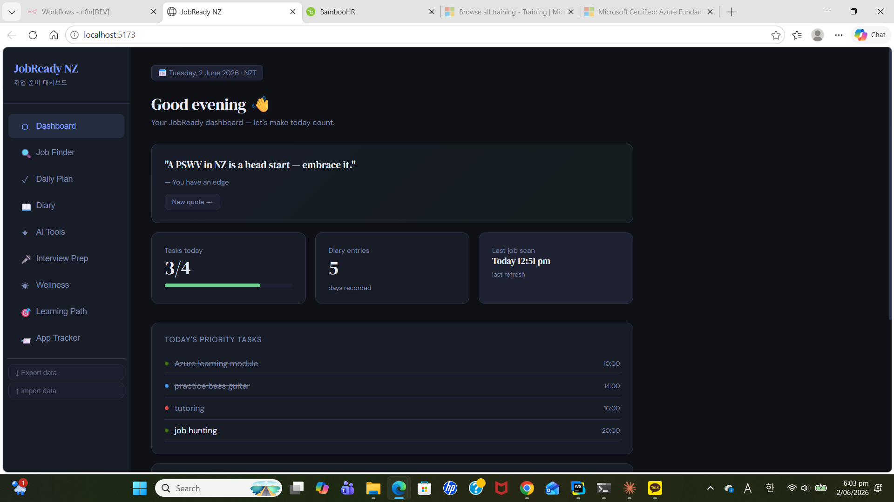
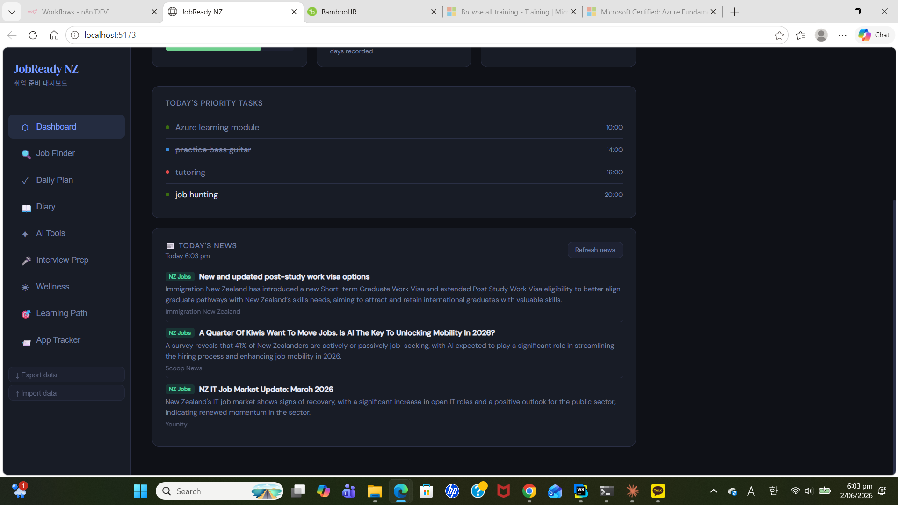
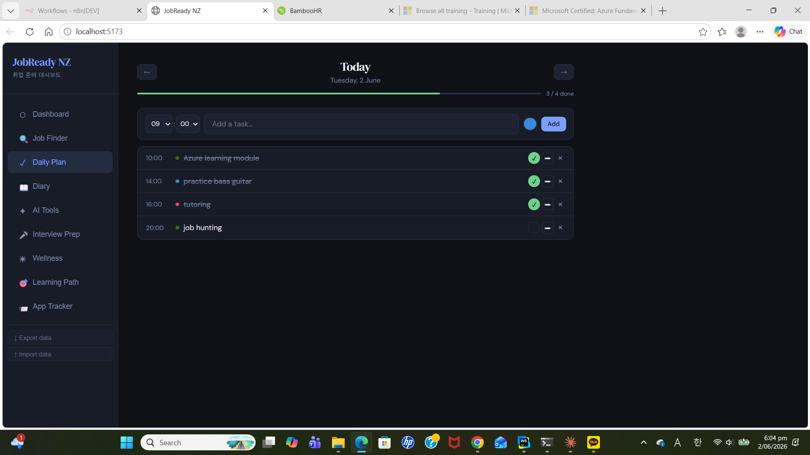
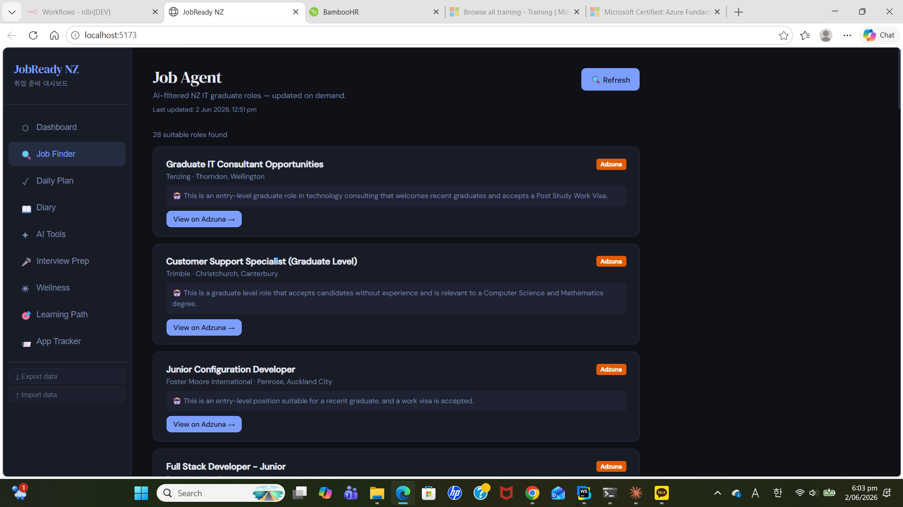
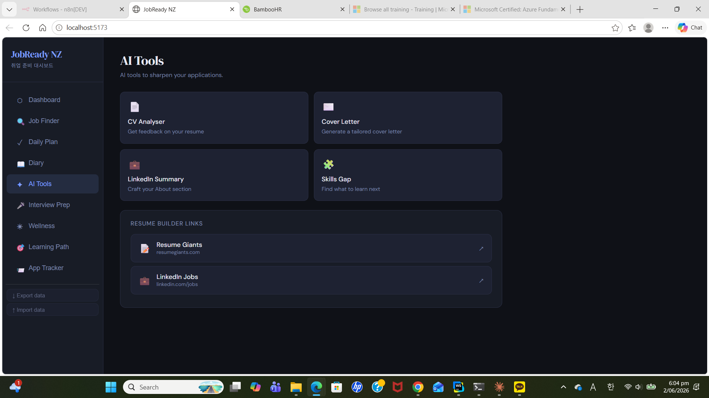
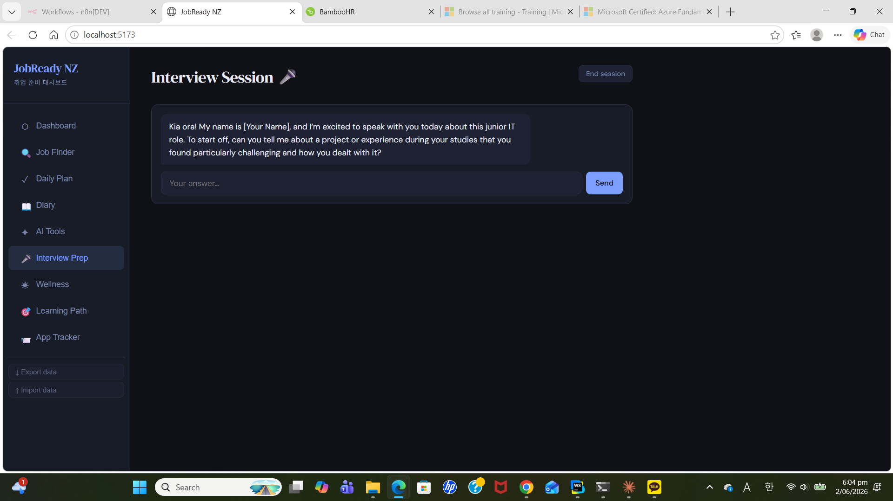
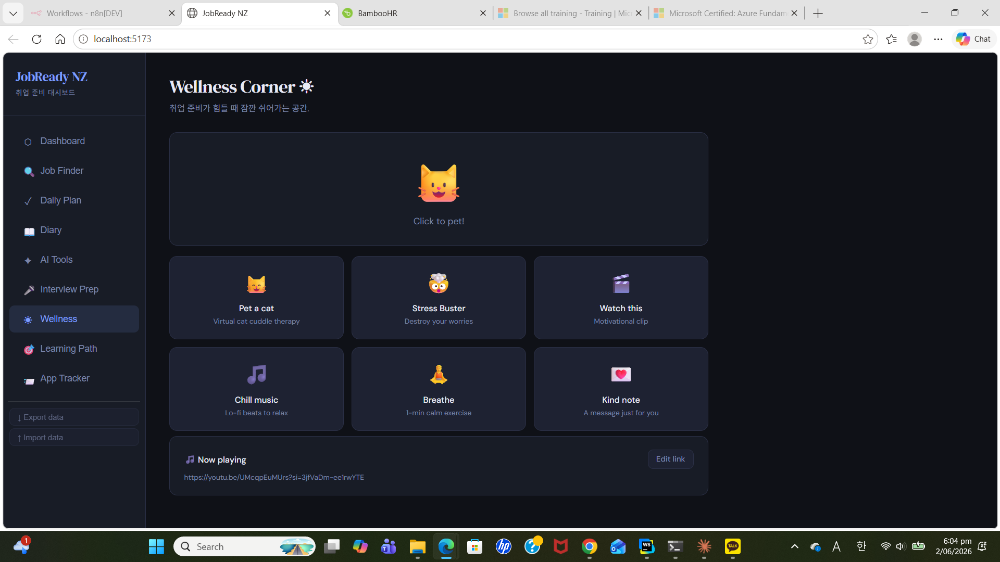
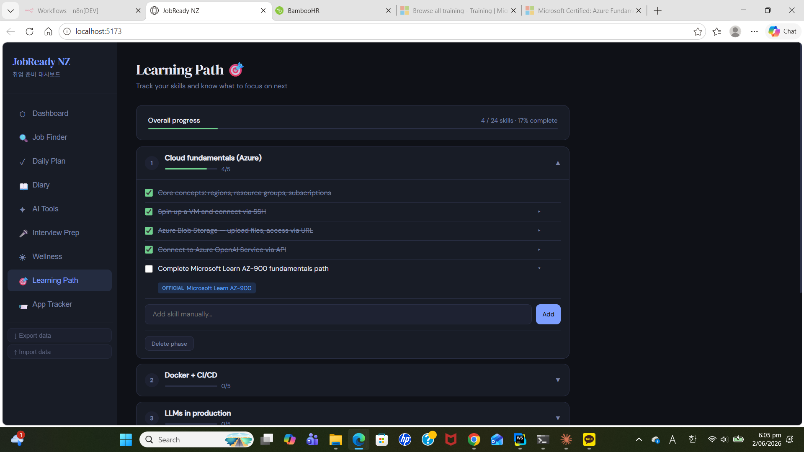
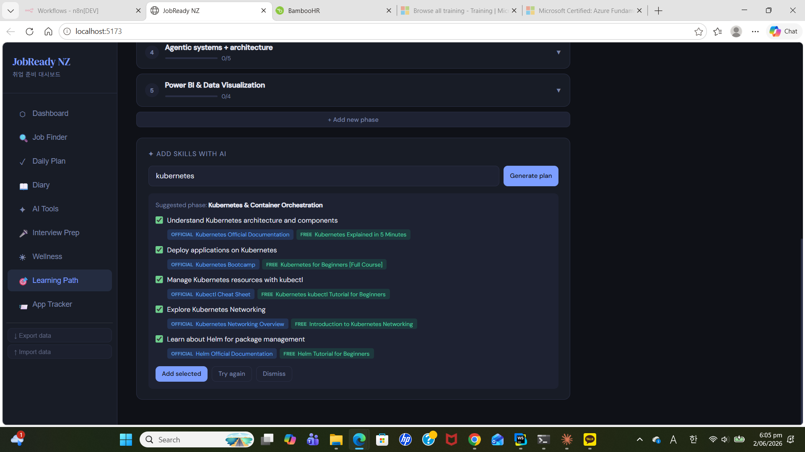
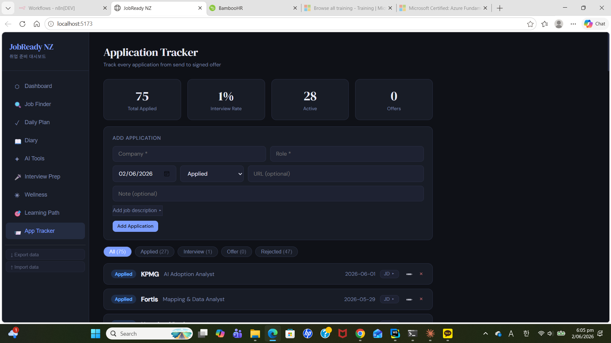

# JobReady NZ 🇳🇿

> A personal productivity and job search dashboard built for NZ IT graduates on a Post Study Work Visa (PSWV).


---

## Project Status

| Feature | Status |
|---------|--------|
| Dashboard | ✅ Complete |
| Daily Planner | ✅ Complete |
| Diary | ✅ Complete |
| AI Tools | ✅ Complete |
| Interview Prep | ✅ Complete |
| Job Finder | ✅ Complete |
| Wellness Corner | ✅ Complete |
| News Automation | ✅ Complete |
| Learning Path | 🔧 In progress |
| Application Tracker | 🔧 In progress |

---

## Screenshots

### Dashboard



### Daily Planner


### Job Finder


### AI Tools


### Interview Prep


### Wellness Corner


### Learning Path



### Application Tracker


---


JobReady NZ is a full-stack web application I built to support my own job search as a recent Computer Science and Mathematics graduate in New Zealand. Rather than juggling multiple tools, everything I need is in one place — daily planning, AI-assisted applications, interview practice, job discovery, and mental wellness.

The app runs locally and is designed for personal use, with a clean dark UI and AI features powered by OpenAI.

---

## Features

### 📋 Daily Planner
- Notebook-style timetable with time slots and colour-coded bullet points
- Navigate between yesterday, today, and tomorrow
- Inline editing — update time, text, or colour without leaving the row
- Progress bar tracking completion for the day
- Data persisted to `localStorage`

### 📖 Diary
- Daily entries with mood tracking (5 mood options)
- Browse and read past entries by date
- Inline delete confirmation to prevent accidental data loss

### ✦ AI Tools (OpenAI powered)
- **CV Analyser** — paste your CV and get NZ-specific feedback
- **Cover Letter Generator** — tailored for NZ graduate roles, PSWV holders
- **LinkedIn Summary** — craft a compelling About section
- **Skills Gap Analyser** — identify what to learn next for the NZ IT market

### 🎤 Interview Prep
- AI interviewer agent powered by OpenAI
- One question at a time with personalised feedback
- Tailored for NZ IT entry-level roles and workplace culture

### 🔍 Job Finder
- Pulls real NZ job listings via **Adzuna API**
- Searches across 10 keyword categories (graduate, junior, analyst, developer, etc.)
- OpenAI filters each listing — excludes roles requiring citizenship/PR, 1+ years experience, or senior level
- Real-time progress bar via **Server-Sent Events (SSE)**
- Direct links to original job listings

### 📰 News Feed (Automated)
- Daily AI & Tech news + NZ job market updates
- **Automated with n8n** — refreshes every morning at 8am
- Click any article to open the original source
- Displayed on Dashboard, always up to date

### ☀ Wellness Corner
- 🐱 Virtual cat to pet (expression changes with each click)
- 💥 Stress Buster — type your stress, click to explode it
- 🎬 Motivational video — curated clip to boost your energy
- 🎵 Chill music link (customisable)
- 🧘 Guided breathing exercise (3 rounds, fixed timer bug)
- 💌 Random motivational messages

### 📊 Dashboard
- At-a-glance stats: today's tasks, diary entries, last job scan
- Rotating quote card
- Today's task preview and latest news
- Clickable cards that navigate to each section

---

## Tech Stack

| Layer | Technology |
|-------|-----------|
| Frontend | React 18 + TypeScript |
| Build | Vite 5 |
| Styling | Pure CSS with CSS Variables (dark theme) |
| Backend | Express.js (local server, port 3001) |
| AI | OpenAI API — gpt-4o-mini |
| Job Data | Adzuna API |
| Automation | n8n (local workflow scheduler) |
| Storage | localStorage (client-side persistence) |

---

## Architecture

```
┌─────────────────────────────────┐
│        React Frontend           │
│  (Vite dev server :5173)        │
│                                 │
│  Dashboard  │  Todo  │  Diary   │
│  AITools    │  Jobs  │ Wellness │
│  Interview  │  News             │
└──────────────┬──────────────────┘
               │ /api/* (Vite proxy)
               ▼
┌─────────────────────────────────┐
│      Express Server :3001       │
│                                 │
│  /api/chat      → OpenAI        │
│  /api/jobs/refresh → Adzuna     │
│                  + OpenAI filter│
│  /api/news/refresh → OpenAI     │
│                  web search     │
│  /api/jobs      → data/jobs.json│
│  /api/news      → data/news.json│
└──────────────┬──────────────────┘
               │
    ┌──────────┴──────────┐
    │                     │
    ▼                     ▼
OpenAI API          Adzuna API
(gpt-4o-mini)      (NZ job data)

n8n scheduler (daily 8am)
    → POST /api/news/refresh
```

---

## Getting Started

### Prerequisites
- Node.js 18+
- OpenAI API key
- Adzuna API credentials (free at [developer.adzuna.com](https://developer.adzuna.com))
- n8n (optional, for news automation)

### Installation

```bash
# Clone the repository
git clone https://github.com/YOUR_USERNAME/jobreadynz.git
cd jobreadynz

# Install dependencies
npm install

# Create environment file
cp .env.example .env
# Add your API keys to .env
```

### Environment Variables

Create a `.env` file in the project root:

```env
OPENAI_API_KEY=sk-...
ADZUNA_APP_ID=your_app_id
ADZUNA_API_KEY=your_api_key
```

### Running the App

```bash
# Terminal 1 — Start the Express API server
npm run server

# Terminal 2 — Start the Vite dev server
npm run dev
```

Open [http://localhost:5173](http://localhost:5173) in your browser.

### News Automation (optional)

```bash
# Install n8n globally
npm install -g n8n

# Start n8n
n8n start
```

Open [http://localhost:5678](http://localhost:5678), create a workflow:
- **Schedule Trigger** → every day at 8am
- **HTTP Request** → POST `http://localhost:3001/api/news/refresh`

Publish the workflow to activate daily automation.

---

## Development Approach

This project was built using an **AI-assisted development workflow** with [Claude Code](https://claude.ai/code) as the primary coding assistant:

- **Claude Code** generated code for each feature based on detailed prompts I wrote
- **I reviewed, tested, and understood** every file before moving to the next feature
- **I made all product decisions** — design, features, UX, filtering logic, tech choices
- **I debugged and directed** when things went wrong (e.g. the job scraping attempts)

This reflects a modern development approach where AI accelerates implementation, while the developer drives architecture, problem-solving, and product thinking. Every prompt, decision, and iteration is documented in [DEVLOG_EN.md](./DEVLOG_EN.md).

**Key challenges I navigated:**
- **CORS & API security** — identified the problem, decided on Express proxy solution
- **Job data sourcing** — evaluated and rejected RSS scraping (403 blocked) and OpenAI web search (URL hallucination) before finding Adzuna's official API
- **Real-time UX** — decided to use Server-Sent Events for live job filtering progress
- **Timer bug** — diagnosed the `setTimeout` cleanup issue in the breathing exercise and directed the fix

---

## Project Status

✅ Core features complete and working locally  
🔜 Application Tracker — coming next  
🔜 Skill Tracker — planned  
📅 Vercel deployment — when ready to go public  

---

## About

Built by a Computer Science and Mathematics graduate from New Zealand, actively looking for entry-level IT roles. This project reflects my interest in full-stack development, AI integration, and building tools that solve real problems.

**A note on language:** This project includes both an English devlog (`DEVLOG_EN.md`) and a Korean devlog (`DEVLOG.md`). As a bilingual developer, I found that certain technical decisions and personal reflections landed more naturally in one language over the other — English for professional documentation and outward-facing communication, Korean for candid thinking and personal notes. Both logs contain the same content; the language just reflects what felt most authentic in the moment.

---

*See [DEVLOG_EN.md](./DEVLOG_EN.md) for the full development history including technical decisions, failed attempts, and lessons learned.*
